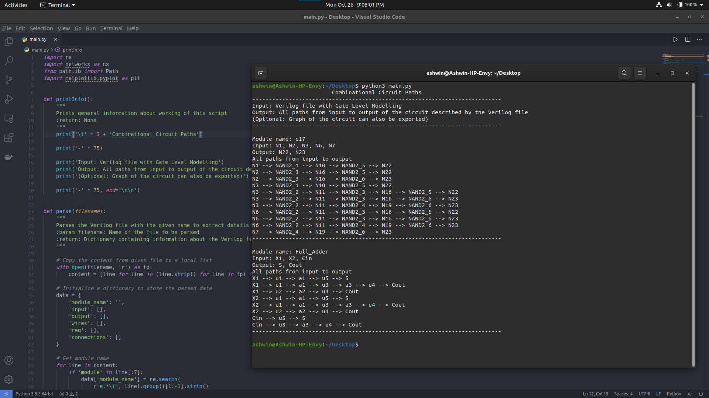

# Circuit Paths

Finding all possible paths between input and output in a given Combinational Circuit.


## Requirements

- [Networkx](https://networkx.org/) for graph algorithms
- [Matplotlib](https://matplotlib.org/) for plotting


## Usage

```shell
pip3 install -r requirements.txt

python3 main.py
```


## Information

Input: Verilog file with Gate Level Modelling

Output: All paths from input to output of the circuit described by the Verilog file

(Optional: Graph of the circuit can also be exported)


## Sample Output




## Sample Output Graphs

### C17 ISCAS85 


### Full Adder

